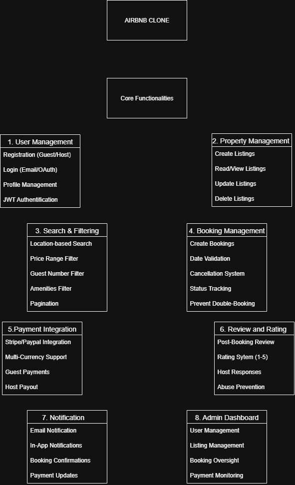

# alx-airbnb-project-documentation
# Airbnb Clone - Backend Features & Functionalities

This document outlines the complete set of features and functionalities required for the Airbnb Clone backend implementation.

## Overview

The backend system will power a full-featured rental marketplace platform similar to Airbnb, handling everything from user authentication to payment processing.

## Core Functionalities

### 1. User Management
- **User Registration**: Sign up as guest or host with secure authentication
- **Login System**: Email/password and OAuth (Google/Facebook) options
- **Profile Management**: Update profiles, photos, and preferences
- **JWT Authentication**: Secure token-based session management

### 2. Property Listings Management
- **CRUD Operations**: Create, read, update, and delete property listings
- **Rich Listing Details**: Titles, descriptions, locations, prices, amenities
- **Availability Management**: Calendar-based availability system

### 3. Search and Filtering
- **Location-based Search**: Find properties by geographic area
- **Advanced Filters**: Price ranges, guest capacity, amenities
- **Pagination**: Handle large result sets efficiently

### 4. Booking Management
- **Booking Creation**: Reserve properties for specific dates
- **Date Validation**: Prevent double-booking conflicts
- **Cancellation System**: Support for various cancellation policies
- **Status Tracking**: Monitor booking states (pending, confirmed, canceled, completed)

### 5. Payment Integration
- **Payment Processing**: Integration with Stripe/PayPal
- **Multi-Currency Support**: Handle transactions in different currencies
- **Payout System**: Automatic transfers to hosts after completed bookings

### 6. Reviews and Ratings
- **Post-Booking Reviews**: Guests can review properties after stays
- **Rating System**: 1-5 star rating scale
- **Host Responses**: Property owners can respond to reviews
- **Abuse Prevention**: Link reviews to actual bookings

### 7. Notifications System
- **Email Notifications**: Booking confirmations, updates, and reminders
- **In-App Alerts**: Real-time notifications within the application
- **Payment Receipts**: Transaction confirmations and records

### 8. Admin Dashboard
- **User Management**: Oversight of all user accounts
- **Content Moderation**: Review and manage property listings
- **Financial Oversight**: Monitor transactions and payouts
- **Analytics**: Platform usage and performance metrics

## Implementation Notes

- All API endpoints will follow RESTful conventions
- Database migrations will be version-controlled
- Environment-specific configurations will be managed securely
- Comprehensive documentation will be maintained for all APIs

## Visual Diagram

*The accompanying diagram provides a visual overview  of features and functionalities required for the Airbnb Clone backend implementation.*

# Use Case Diagram

This provides us with a use case diagram for the Airbnb Clone project, visualizing the interactions between users and the system.

## Use Case Diagram Overview

The use case diagram illustrates the main functionalities of the Airbnb Clone system and how different actors interact with these functionalities.

