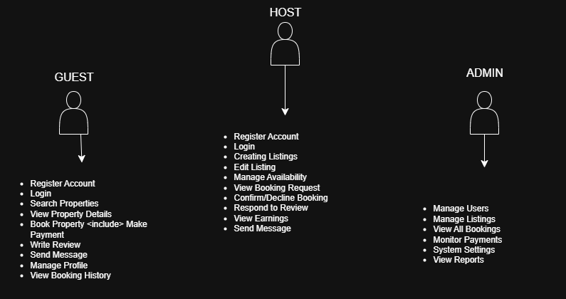

# **alx-airbnb-project-documentation**

# Airbnb Clone - Use Case Diagram

This document provides a use case diagram for the Airbnb Clone project, visualizing the interactions between users and the system.

## Use Case Diagram Overview

The use case diagram illustrates the main functionalities of the Airbnb Clone system and how different actors interact with these functionalities.

*The accompanying diagram provides a visual overview  of features and functionalities required for the Airbnb Clone backend implementation.*

## Actors

1. **Guest**: A user who searches for and books properties
2. **Host**: A user who lists and manages properties
3. **Admin**: A system administrator who manages the platform

## Key Use Cases

### Guest Use Cases
- Register Account
- Login
- Search Properties
- View Property Details
- Book Property
- Make Payment
- Write Review
- Send Message to Host
- Manage Profile
- View Booking History

### Host Use Cases
- Register as Host
- Login
- Create Property Listing
- Edit Property Listing
- Manage Availability Calendar
- View Booking Requests
- Confirm/Decline Booking
- Respond to Reviews
- View Earnings
- Send Message to Guest

### Admin Use Cases
- Manage Users
- Manage Listings
- View All Bookings
- Monitor Payments
- Manage System Settings
- View Reports

## Relationships

- The "Book Property" use case includes the "Make Payment" use case
- All actors can perform the "Login" use case
- Guests and Hosts can both send messages to each other

## Purpose

This use case diagram serves as:
- A visual representation of system functionality
- A guide for development priorities
- A communication tool for stakeholders
- A foundation for detailed requirement specifications